# 2. Typescript

Praktikum - Bagian 1 : Instalasi Typescript
---

* install typescript

* mengecek versi typescript

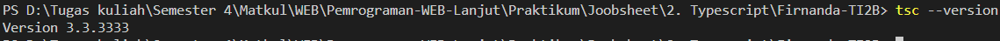

* main.ts

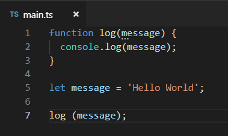

* transpile file dari main.ts menjadi main.js

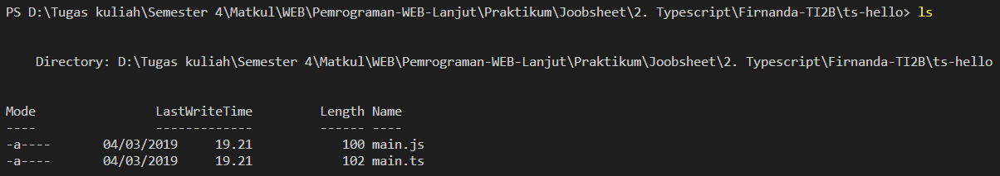

* main.js

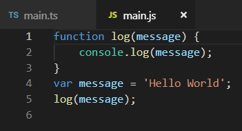

* hasil dari node main.js

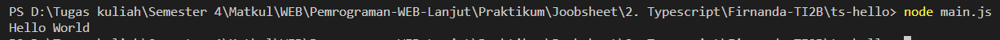

* main.ts

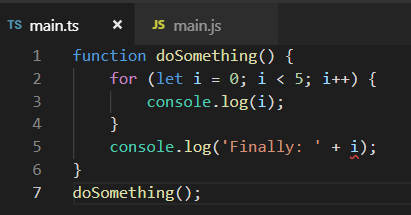

* hasil dari node main.js

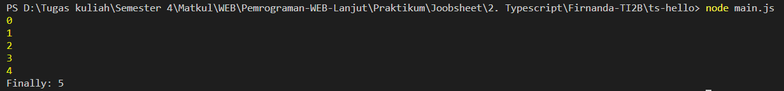

* main.ts

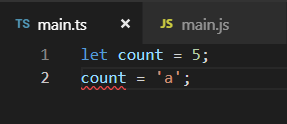

* main.js

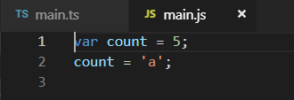

* main.ts

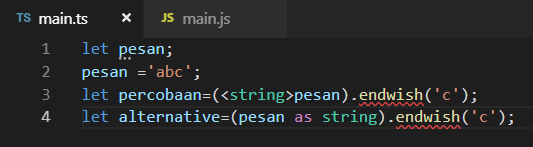

* main.ts

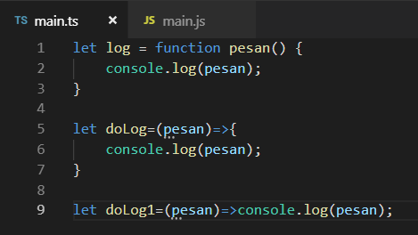

* main.ts

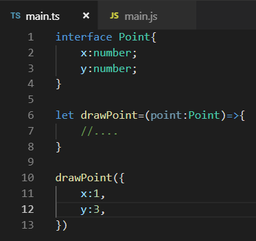

* main.ts

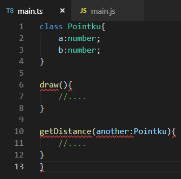

* main.ts

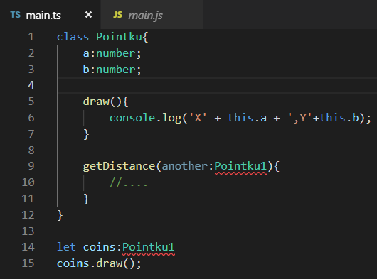