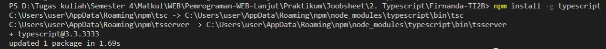

# 2. Typescript

Praktikum - Bagian 1 : Instalasi Typescript
---

* install typescript

* mengecek versi typescript

* main.ts

* transpile file dari main.ts menjadi main.js

* main.js

* hasil dari node main.js

Praktikum Bagian 2 : Declaring Variables
---

* main.ts

* hasil dari node main.js

Praktikum Bagian 3 : Types
---

* main.ts

* main.js

Praktikum Bagian 4 : Type Assertion
---

* main.ts

Praktikum bagian 5 : Arrow Function
---

* main.ts

Praktikum Bagian 6 : Interface
---

* main.ts

Praktikum Bagian 7 : Classes
---

* main.ts

Praktikum Bagian 8 : Objects
---

* main.ts

