# 3. Angular Fundamental

Praktikum – Bagian 1 : Component Basic
---

* install ng g c courses

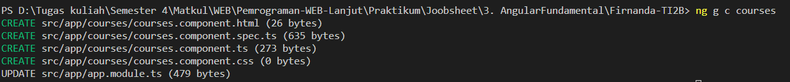

* menambahkan code di app.component.html

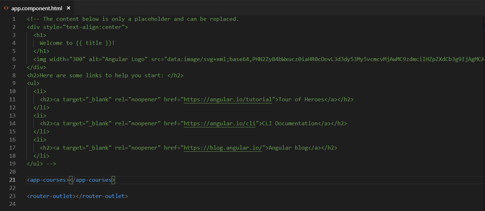

* hasil

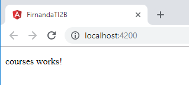

* menghapus coursecomponent pada app.modules.ts

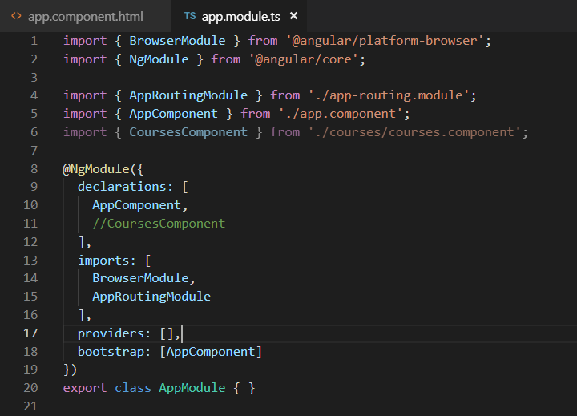

* melihat hasil inspect

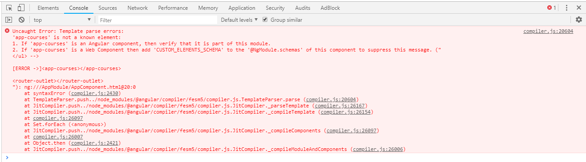
>Penjelasan: CoursesComponent merupakan elemen penting pada NgModule, jika dihapus maka angular tidak dapat menampilkan isi dari html

Praktikum bagian 2 : Templates
---

* menambahkan property pada courses.component.ts

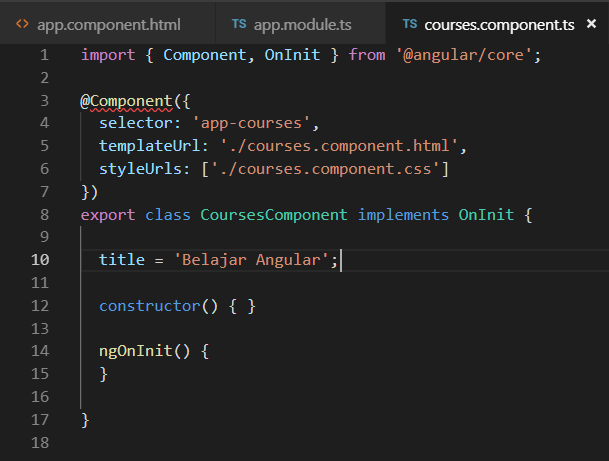

* menambahkan string binding data

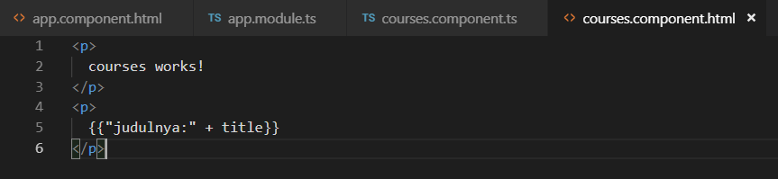

* hasil

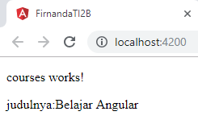

* menambahkan method pada file courses.component.ts

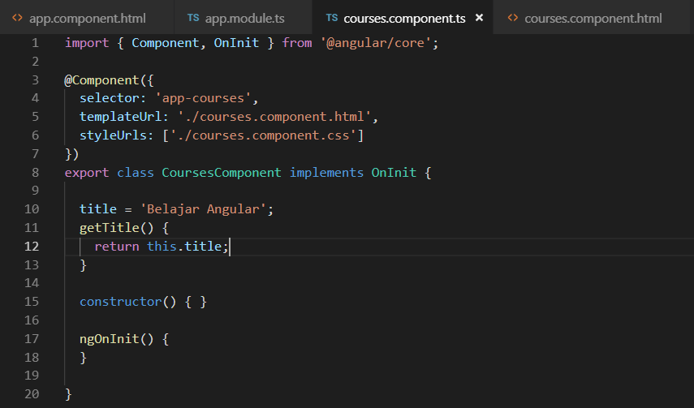

* memodifikasi pada file courses.component.html

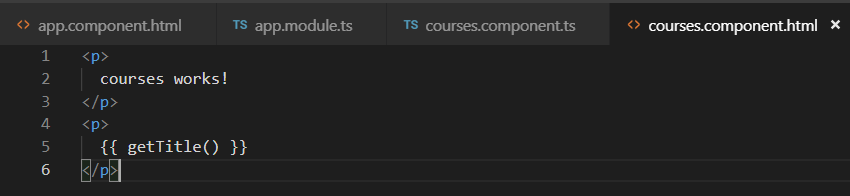

* hasil

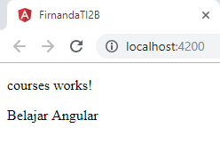

Praktikum Bagian 3 : Directive
---

* membuat property pada file courses.component.ts

* menambahkan ngfor pada file courses.component.html

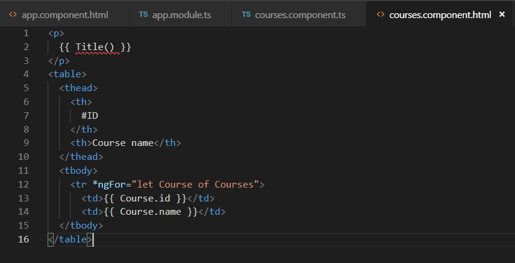

* hasil

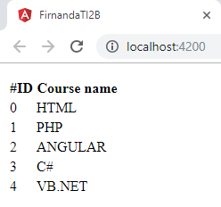

Praktikum – Bagian 4 : Services	dan	Dependency Injection
---

* menambahkan method getCourse pada file courses.service.ts

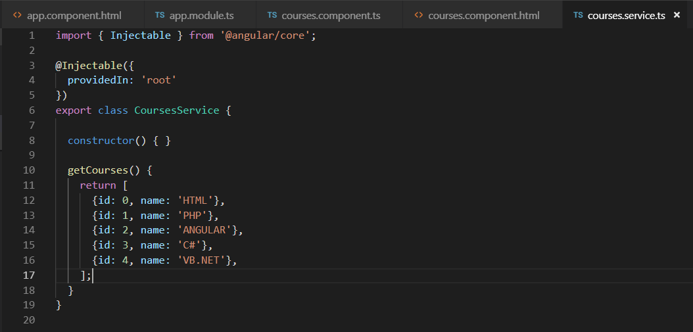

* memodifikasi code pada file courses.component.ts

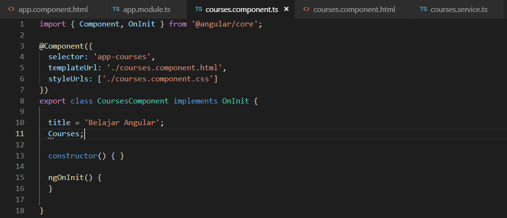

* menambahkan constructor

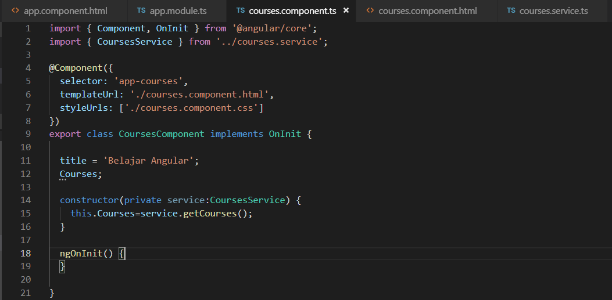

* hasil

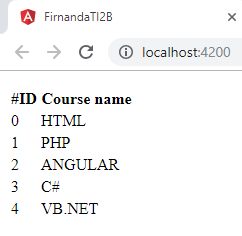