# 4. Displaying Data And Binding Data

Praktikum - Bagian 1 : Component Basic
---

* menambahkan code pada file couerses.component.ts

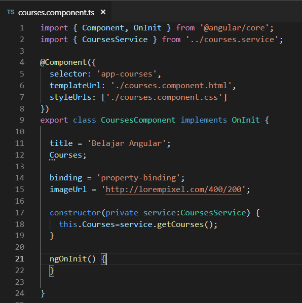

* menambahkan code pada file course.component.html

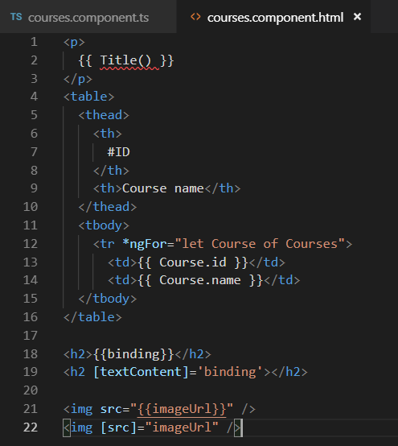

* hasil

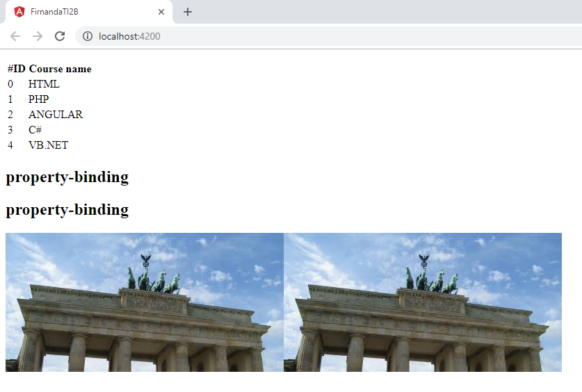

Praktikum - Bagian 2 : Attribute Binding
---

* menambahkan property colSpan pada file courses.component.ts

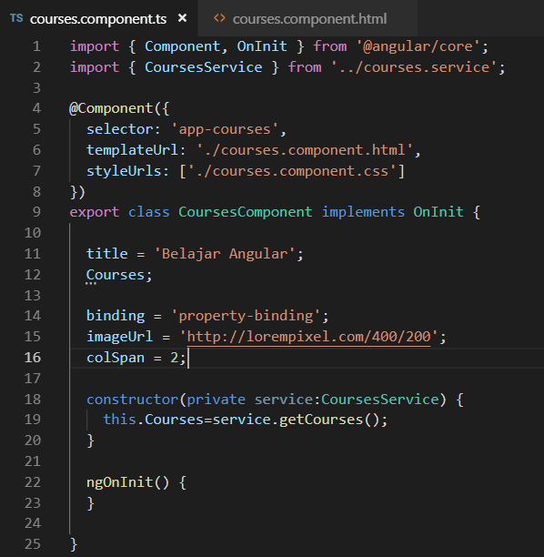

* menambahkan code pada file courses.component.html

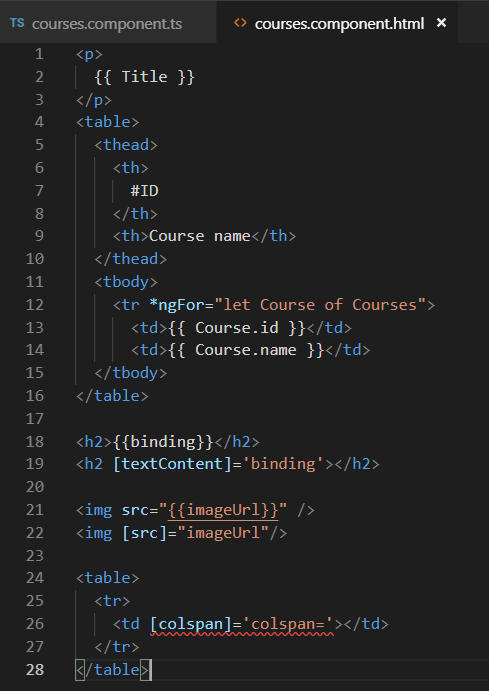

* hasil

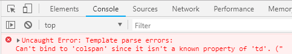

* menambahkan attr colspan

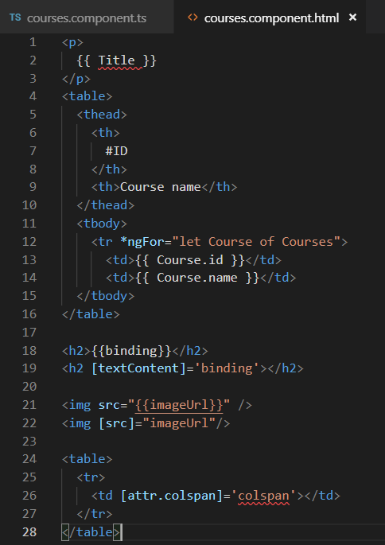

* hasil

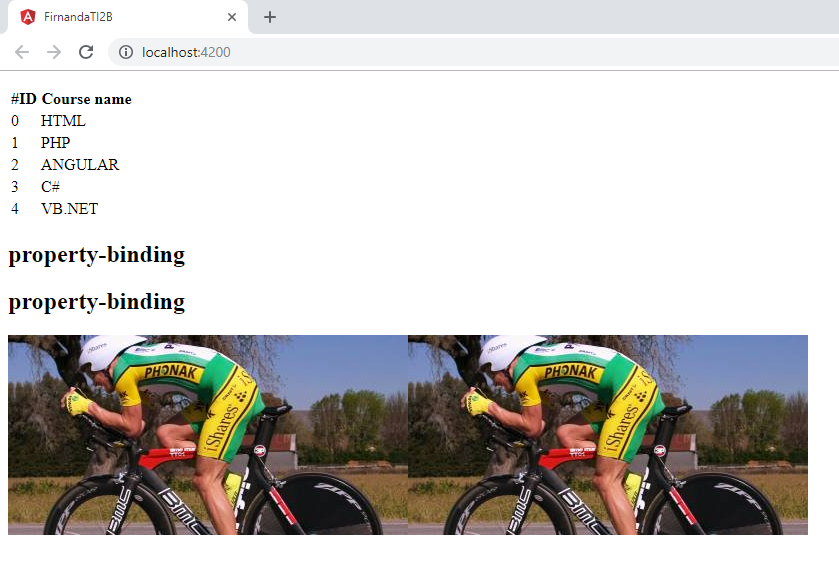

* menambahkan button pada file courses.component.html

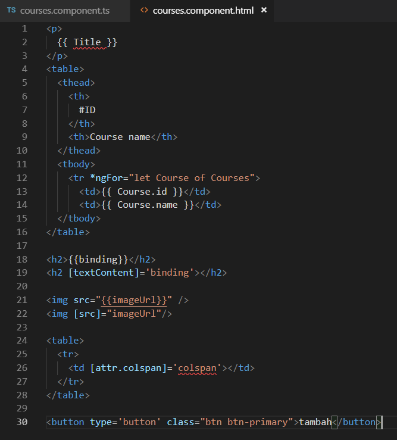

* hasil

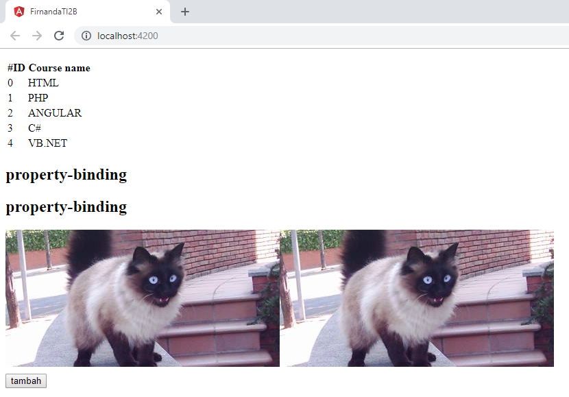

Praktikum - Bagian 3 : Class Binding
---

* menambahkan property isActive = true pada file courses.component.ts

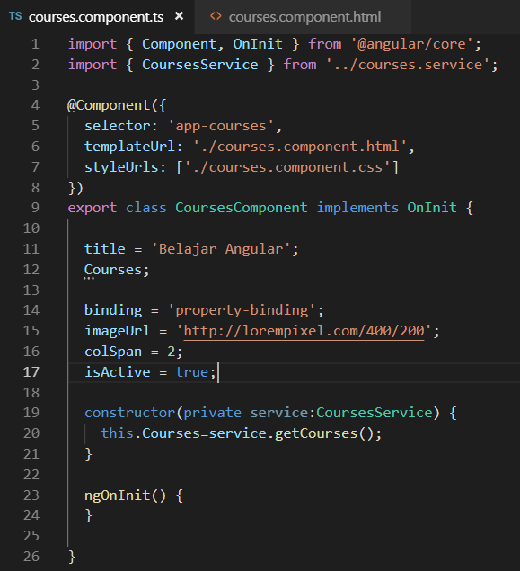

* menambahkan class binding pada courses.component.html

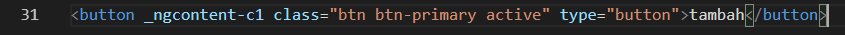

* hasil

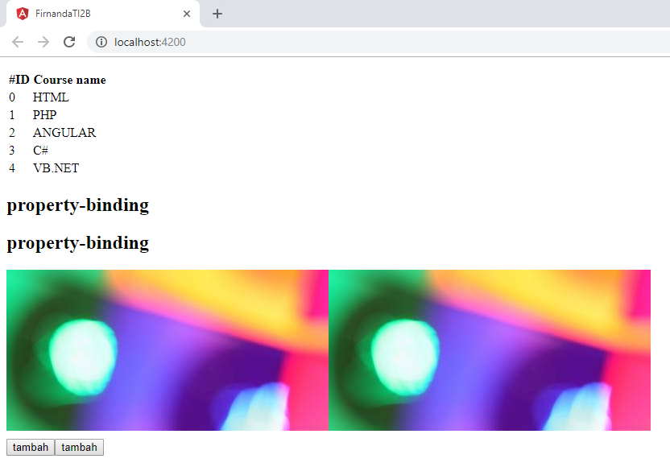

Praktikum - Bagian 4 : Style Binding
---

* menambahkan code pada file courses.component.html

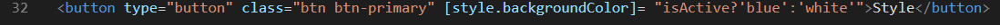

* hasil

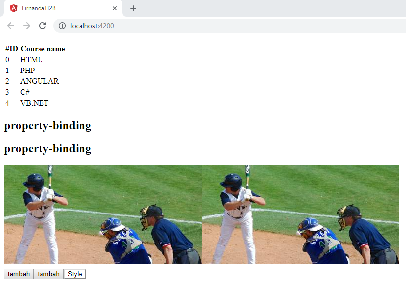

Praktikum - Bagian 5 : Event Binding
---

* membuat method onsave pada file courses.component.ts

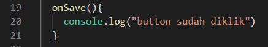

* menambahkan event click pada file courses.component.ts

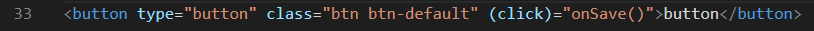

* hasil

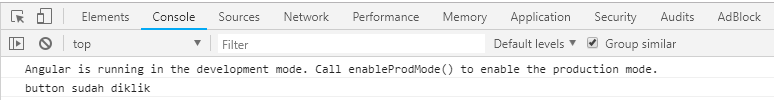

* menambahkan parameter $event pada file courses.component.ts

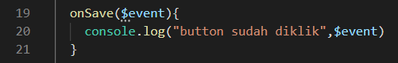

* hasil

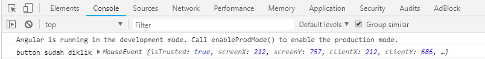

* membuat method onDivClick pada file courses.component.ts

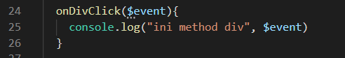

* menambahkan div dan event binding pada div elemen

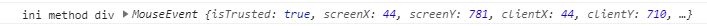

* menambahkan $event.stopPropagation pada courses.component.ts

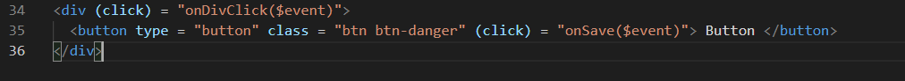

Praktikum - Bagian 6 : Event Filtering
---

* membuat inputan pada courses.component.html

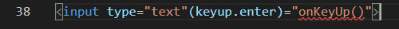

* menambahkan method onKeyUp

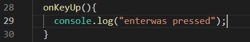

* hasil

Praktikum - Bagian 7 : Template Variable
---

* menambahkan variabel #nama pada courses.component.html

* menambahkan parameter nama pada method onKeyUp

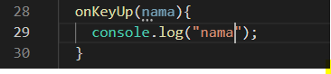

* hasil

Praktikum - Bagian 8 : Two Way Binding
---

* Buat property baru dengan nama kalian masing-masing dan rubah parameter pada log

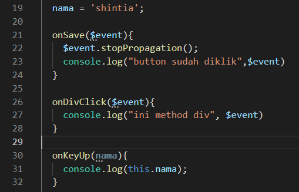

* menambahkan parameter nama pada method onKeyUp

* hasil

* menambahkan formmodule pada file app.module.ts

* memodifikasi code pada file courses.component.html

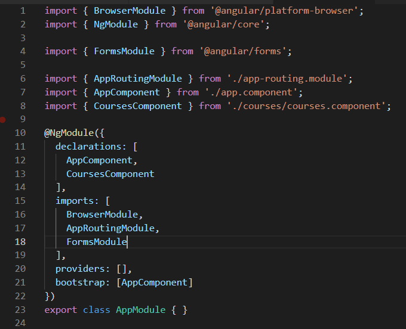

* hasil

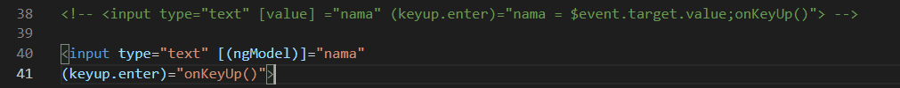